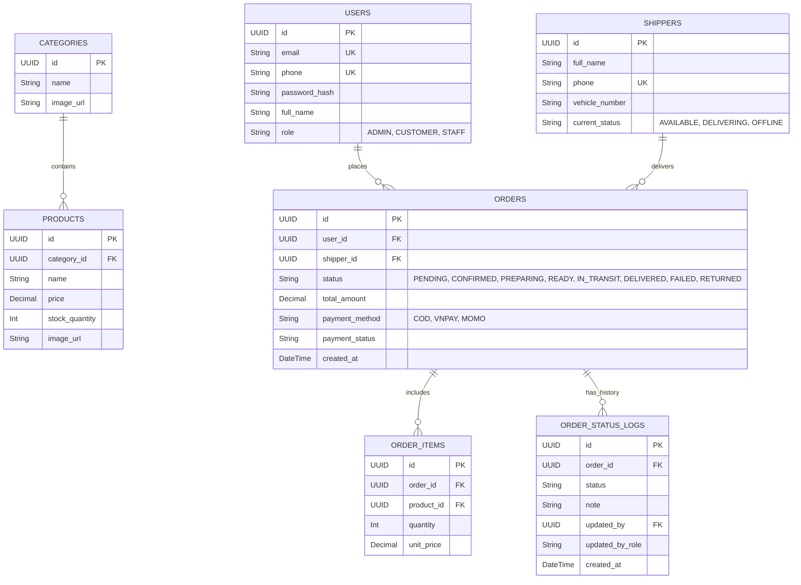

# 27 - Thiết Kế Kiến Trúc Backend (Spring Boot + PostgreSQL)
Dự án: **Vựa Vui Vẻ** (Nền tảng TMĐT Thực Phẩm Tươi Sống)

Tài liệu này định nghĩa toàn bộ kiến trúc Backend, CSDL và các tính năng cốt lõi sẽ được triển khai.

## 1. Tổng Quan Công Nghệ (Tech Stack)
- **Framework:** Java 17 + Spring Boot 3.x
- **Database:** PostgreSQL (Lưu trữ chính)
- **ORM:** Spring Data JPA + Hibernate
- **Caching & Giỏ hàng:** Redis
- **Security:** Spring Security + JWT
- **Realtime:** Spring WebSockets / SSE
- **Tài liệu API:** Swagger (springdoc-openapi)
- **Lưu trữ ảnh:** Cloudinary hoặc AWS S3 (Không lưu ảnh vào DB)

---

## 2. Lược Đồ Cơ Sở Dữ Liệu Cập Nhật (ERD)

Lược đồ bao gồm người dùng, cửa hàng, giao dịch, và luồng theo dõi giao hàng (Shipper).

---

## 3. Luồng Giao Hàng & Tracking (Shipper Flow)

Quy trình chuẩn khép kín được lưu log lại hoàn toàn:
1. `PENDING`: Khách đặt hàng.
2. `CONFIRMED`: Admin duyệt.
3. `PREPARING` -> `READY_FOR_PICKUP`: Kho chuẩn bị xong, gán Shipper (`shipper_id`).
4. `IN_TRANSIT`: Shipper lấy hàng đi giao.
5. **Kết quả cuối:**
   - `DELIVERED`: Shipper giao thành công (Bắn Realtime về Admin).
   - `FAILED`: Giao thất bại (Shipper phải nhập lý do).
   - `RETURNED`: Hoàn trả hàng về kho.

---

## 4. Các Chiến Lược Kỹ Thuật Nâng Cao

1. **Quản lý Hình ảnh (Cloudinary/S3):** Chỉ lưu URL trong CSDL để tối ưu tốc độ truy vấn, không lưu nhị phân (BLOB).
2. **Tự động Hủy Đơn (Cron Job):** Dùng `@Scheduled` quét định kỳ. Đơn VNPAY/MOMO sau 15 phút không thanh toán tự động chuyển trạng thái `CANCELLED` và hoàn lại số lượng tồn kho (Stock).
3. **Bảo mật JWT an toàn:** Cấp `Access Token` (tuổi thọ ngắn 15 phút) và `Refresh Token` (lưu dài hạn trên thiết bị) để giữ trạng thái đăng nhập cho App Android mà vẫn an toàn.
4. **Caching với Redis:** Lưu danh sách sản phẩm và Giỏ hàng (Cart) lên RAM (Redis) để phản hồi trong vài mili-giây, giảm tải cho PostgreSQL.
5. **Tài liệu API (Swagger UI):** Tự động sinh giao diện test API tại đường dẫn `/swagger-ui.html` cho các bạn làm App Android dễ dàng theo dõi.
6. **Xử lý AI Chatbot Bất đồng bộ:** Dùng `@Async` hoặc CompletableFuture khi gọi Google Gemini API để không làm treo hệ thống trong lúc chờ AI phản hồi.
7. **Sandbox Thanh Toán:** Dùng tính năng Profiles (`application-dev.yml` và `application-prod.yml`) kết hợp **Ngrok** để nhận Webhook (IPN) từ VNPay/MoMo ngay trên máy cá nhân.

---

## 5. Lộ Trình Triển Khai (Kế Hoạch)

- [x] **Giai đoạn 1: HOÀN THÀNH ✅** — Khởi tạo Project Spring Boot, cấu hình PostgreSQL, Redis, Swagger. Cấu trúc các package.
  - `pom.xml` — Maven dependencies (Spring Boot 3.3, JPA, PostgreSQL, Redis, JWT, Swagger, Cloudinary, Lombok)
  - `application.yml` — Profile dev là mặc định
  - `application-dev.yml` — Cấu hình Sandbox đầy đủ (VNPay, MoMo, Cloudinary, Gemini)
  - `VuaVuiVeBackendApplication.java` — Main class với @EnableCaching, @EnableAsync, @EnableScheduling
  - `BaseEntity.java` — UUID + Timestamp tự động cho mọi Entity
  - `User.java` — Entity User (CUSTOMER/STAFF/ADMIN)
  - `Shipper.java` — Entity Shipper (AVAILABLE/DELIVERING/OFFLINE)
  - `Category.java` — Entity Category (phân cấp cha-con)
  - `Product.java` — Entity Product (giá gốc/giá bán, tồn kho, đơn vị)
  - `Order.java` — Entity Order + State Machine 9 trạng thái
  - `OrderItem.java` — Entity chi tiết đơn hàng (snapshot giá)
  - `OrderStatusLog.java` — Entity Timeline lịch sử trạng thái
  - `JwtUtils.java` — JWT Access Token (15') + Refresh Token (30 ngày)
  - `AppException.java` — Custom Exception với factory methods
  - `GlobalExceptionHandler.java` — Bắt lỗi tập trung, trả JSON chuẩn
  - `UserRepository.java`, `ProductRepository.java`, `OrderRepository.java` — JPA Repositories
- [ ] **Giai đoạn 2:** Triển khai Security Config, JWT Filter, AuthController (Đăng ký/Đăng nhập/Refresh Token).
- [ ] **Giai đoạn 3:** Xây dựng ProductController/Service, CategoryController, Caching sản phẩm với Redis.
- [ ] **Giai đoạn 4:** Hoàn thiện OrderService (@Transactional), Tích hợp Thanh toán Sandbox (VNPay/MoMo Webhook).
- [ ] **Giai đoạn 5:** ShipperController, Realtime thông báo cho Admin (WebSockets), Auto-cancel Cron Job.
- [ ] **Giai đoạn 6:** Tích hợp AI Chatbot (Gemini) bất đồng bộ (@Async), Swagger hoàn chỉnh.
