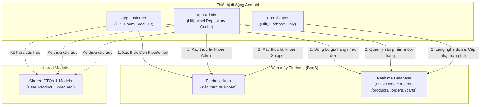
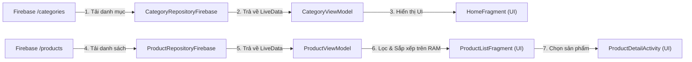
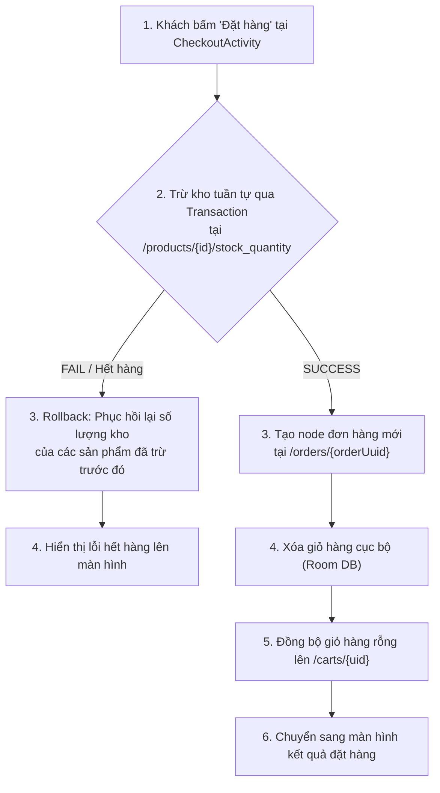
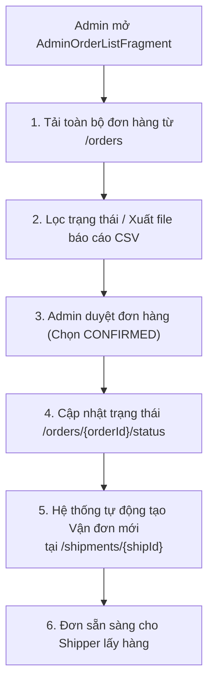
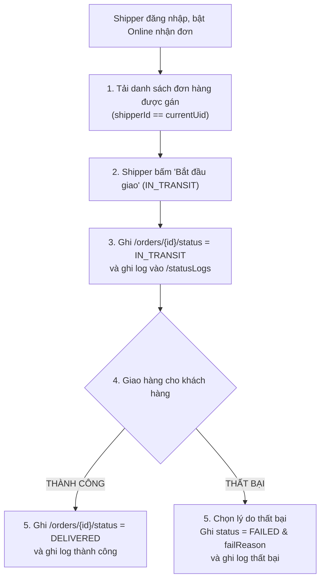

# PHẦN 6 — SƠ ĐỒ HỆ THỐNG MERMAID (SYSTEM DIAGRAMS)

Tài liệu này chứa 5 sơ đồ luồng dữ liệu và kiến trúc được thiết kế bằng ngôn ngữ Mermaid Markdown để chèn trực tiếp vào báo cáo đồ án của bạn.

---

## 1. Sơ đồ Kiến trúc Tổng thể (Overall Architecture Diagram)

Sơ đồ mô tả tương tác giữa 3 ứng dụng khách và dịch vụ đám mây Firebase Auth / Realtime Database, thông qua việc kế thừa module `:shared`.

---

## 2. Luồng Dữ liệu Sản phẩm của Khách hàng (Customer Product Data Flow)

Sơ đồ mô tả cách Customer App hiển thị danh mục, tải sản phẩm, lọc danh mục và xem chi tiết sản phẩm.

---

## 3. Luồng Tạo đơn hàng & Thanh toán (Customer Checkout / Order Creation Flow)

Sơ đồ mô tả quy trình checkout phức tạp của Khách hàng, bao gồm kiểm tra tồn kho bằng Transaction và cơ chế Rollback khi xảy ra lỗi.

---

## 4. Luồng Quản lý Đơn hàng của Admin (Admin Order Management Flow)

Sơ đồ mô tả luồng kiểm duyệt đơn hàng, xuất báo cáo CSV và tự động tạo vận đơn (Shipment) của Quản trị viên.

---

## 5. Luồng Cập nhật Trạng thái Giao hàng của Shipper (Shipper Delivery Status Flow)

Sơ đồ mô tả luồng cập nhật đơn hàng của tài xế khi giao hàng, bao gồm cập nhật trạng thái đơn và ghi nhật ký statusLogs.

